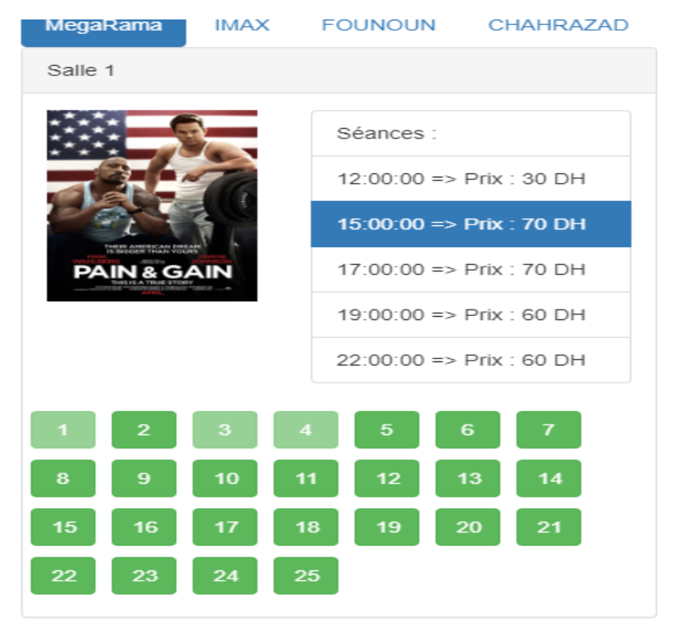

<h2>technologies</h2>

in this project ,as frontend i used <strong>angular</strong>  with typscript as programming language 
as for backend i used <strong>spring</strong> as framework with java as programming language and mysql as database

here is the <a href='https://github.com/kensamaa/projet-cinema'>link</a> for the backend folder 

<h2>screenshuts</h2>

